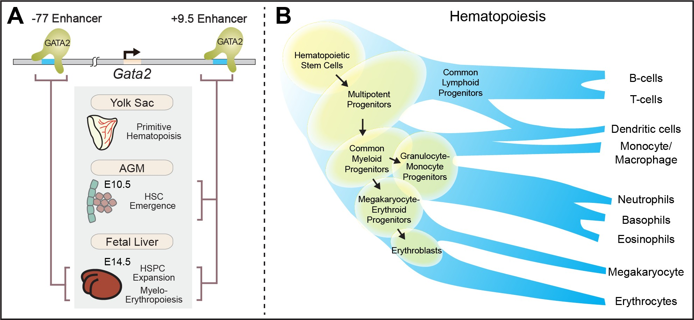
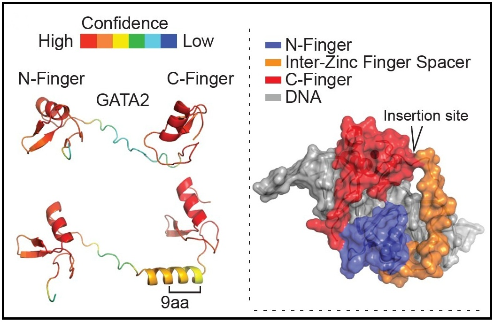

## GATA2: master regulator of hematopoiesis

**GATA2 is an essential transcription factor that promotes hematopoietic stem and progenitor cell (HSPC) generation and function.**

{width="800px"}

**Figure 1: A.** (Adapted from Bresnick and Johnson. *Blood Adv.* 2019.) The murine -77 and +9.5 transcriptional enhancers reside 77 and 9.5 kb upstream and downstream, respectively, of the *Gata2* transcriptional start site. These enhancers are critical for mouse embryogenesis and hematopoiesis. The +9.5 enhancer confers hematopoietic stem cell (HSC) emergence at E10.5 in the AGM, and the -77 enhancer confers HSPC expansion and myelo-erythropoiesis at E14.5 in the fetal liver. **B.** GATA2 expression confers hematopoiesis. HSPC expansion impacted by GATA2 are highlighted in yellow.

## *GATA2* wild type vs 9 amino acid insertion variant

**The *GATA2* 9–amino acid insertion variant formed the foundation of my doctoral work.**

{width="600px"}

**Figure 2:** AlphaFold rendering comparing GATA2 wild-type and 9aa insertion variant.

This patient-derived in-frame insertion (p.A345delinsALLVAALLAA), located in the inter-zinc finger spacer region (Cavalcante de Andrade Silva et al. *Leukemia*. 2021), revealed how disruption of a transcription factor can drive genome-wide regulatory changes rather than isolated gene effects (Jung et al. *J Clin Invest*. 2023). Studying this variant led to the discovery that GATA2 decommissions inflammatory enhancers, linking regulatory dysfunction to immune dysregulation and blood cancer predisposition (Jung et al. *Cell Rep*. 2025).

------------------------------------------------------------------------
